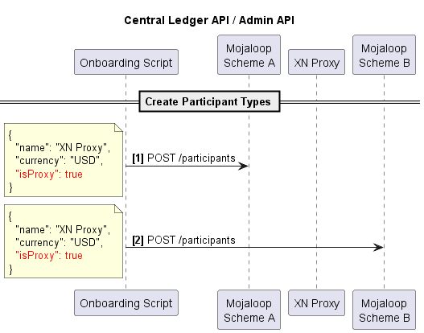

# Proxy Implementation
The proxy implementation method to connect schemes does the following.
1. Leverages the trust relationship between scheme so that a transaction only has a single pre-funding requirement at the Payer's scheme.
2. Ensures non-repudiation across schemes; removing the requirement for the cross-network proxy to take on responsibility for clearing; which removes costs

The schemes are connected via a proxy participant, that is registered to act as a proxy in the scheme for adjacent but connected dfsps in other schemes. 
Essentially, the two connected schemes behave as if they where a single scheme.

This design make the following assumptions
1. No two connected participant have the same identifier
1. No limit checks are done against proxy participants
1. Get \transaction request are resolved at the payee scheme
1. Timeouts in non-payee schemes are  disabled (maybe enlarged)

## General Patterns
There are certain general patterns that emerge
### Happy Path Patterns

### Error Patterns

## Detailed Designs
1. [Discovery - On Demand Implementation](./Discovery.md)
2. [P2P](./P2P.md)

## Admin API - defining Proxy Participants

### ALS Proxy Timeout flow
1. If no party info returned from Oracle (see [diagram](./Discovery.md)), and there's some proxies in the hub, we need to send 
  GET /parties/... requests to each proxy. And wait for the response.
2. At this moment we add 2 records in cache (redis) using `inter-scheme-proxy-cache-lib`:
  - key: `als:${sourceId}:${type}:${partyId}` value: `[proxy_1, proxy_2, ...]` (no TTL)
  - key: `als:${sourceId}:${type}:${partyId}:expiresAt` value: `expiresAt`  (TTL: default 40 seconds)
3. When we get success/failure callbacks from all proxies within TTL period, we process it, and remove `...:expiresAt` key from cache.
4. If not all callbacks received within TTL period, redis will expire `...:expiresAt` key, emit appropriate event, and pass _expired cacheKey_.
5. We subscribe to these events, and provide a [callback](https://github.com/mojaloop/account-lookup-service/blob/feat/fx-impl/src/domain/timeout/index.js#L53) to be executed in case of timeout.
6. From _expired cacheKey_, we get `destination`, `partyType` and `partyId`, which is used to send error callback to appropriate participant.
